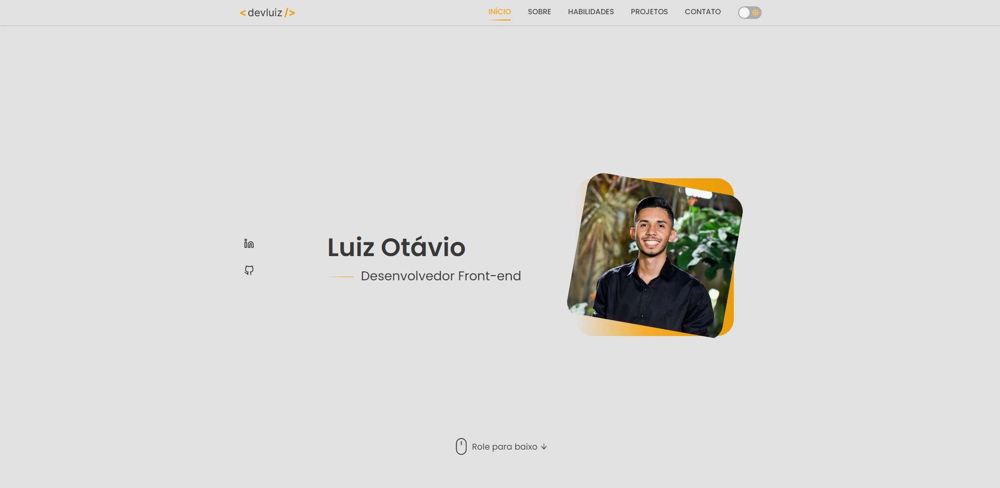

<h1 align="center">Portfólio - Luiz Otávio</h1>

## 📝 Sobre

Meu portfólio pessoal, o qual exibo informações sobre mim e os meus projetos desenvolvidos

<h4 align="center"><a href="https://devluiz.netlify.app/">Clique para visitar o projeto</a></h4>

## 📚 Seções

O site é composto por cinco seções:

- **Início**: Seção de breve apresentação
- **Sobre**: Seção com descrição dizendo um pouco sobre quem sou
- **Habilidades**: Seção para apresentação dos meus conhecimentos no âmbito de desenvolvimento com foco no front-end.
- **Projetos**: Seção para exibir projetos já desenvolvidos, com link para o GitHub
- **Contato**: Seção para entrar em contato comigo, através do e-mail, LinkedIn, WhatsApp e até mesmo mensagem direta

## 🚀 Tecnologias:

- HTML
- CSS
- JavaScript
- React.js

## 💻 Features

- Light e Dark mode
- Responsividade para todos os dispositivos
